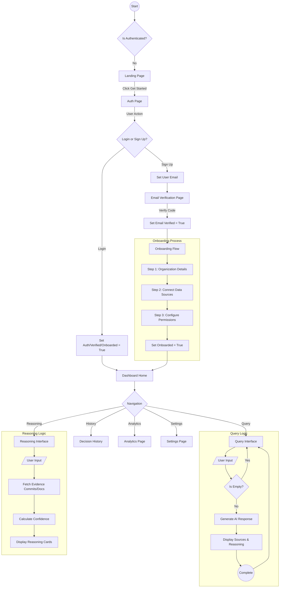

# Infinium User Activity Flow

This document maps the user journey and application logic based on the `src/app` components.

## Activity Diagram (Mermaid)

## Flow Description

1.  **Authentication Phase**:
    *   Users start at the **Landing Page**.
    *   **Sign Up**: Follows the full path: `Email Verification` -> `Onboarding` -> `Dashboard`.
    *   **Login**: In the current `App.tsx` implementation, logging in acts as a shortcut that sets all states (Verified, Onboarded) to `true` instantly, skipping the setup wizard.

2.  **Onboarding Phase**:
    *   A linear 3-step wizard collecting Organization Info, Data Source integrations (GitHub, Slack, etc.), and Permissions.

3.  **Core Application**:
    *   Once fully authorized, the user lands on the **Dashboard**.
    *   Navigation allows switching between specialized tools like the **Query Interface** (RAG-based chat) and **Reasoning Interface** (Evidence-based analysis).
