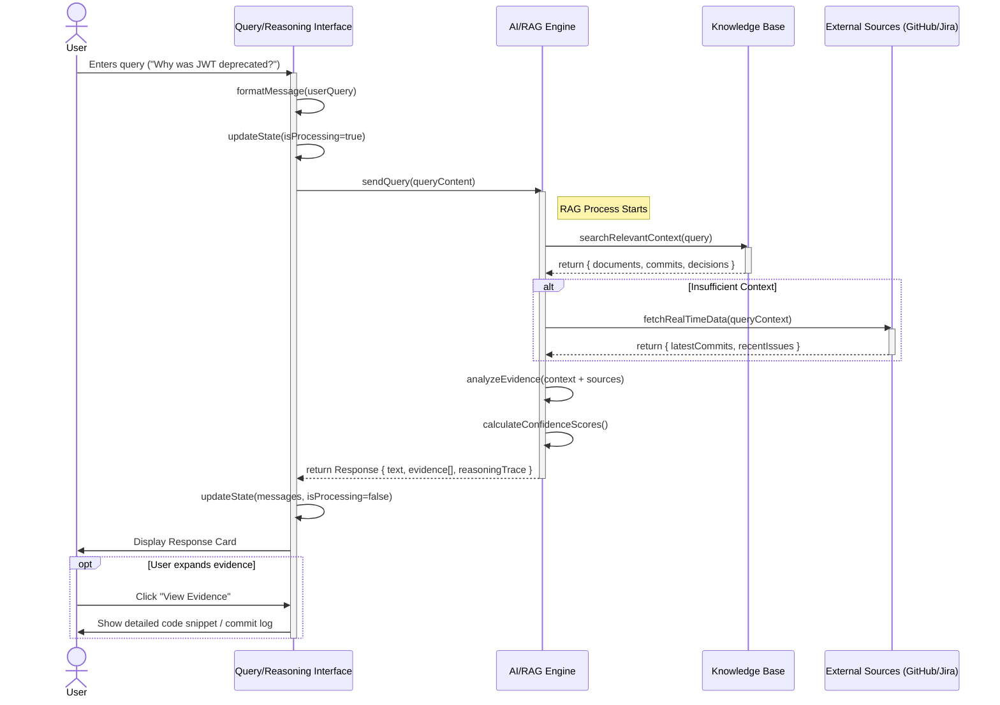
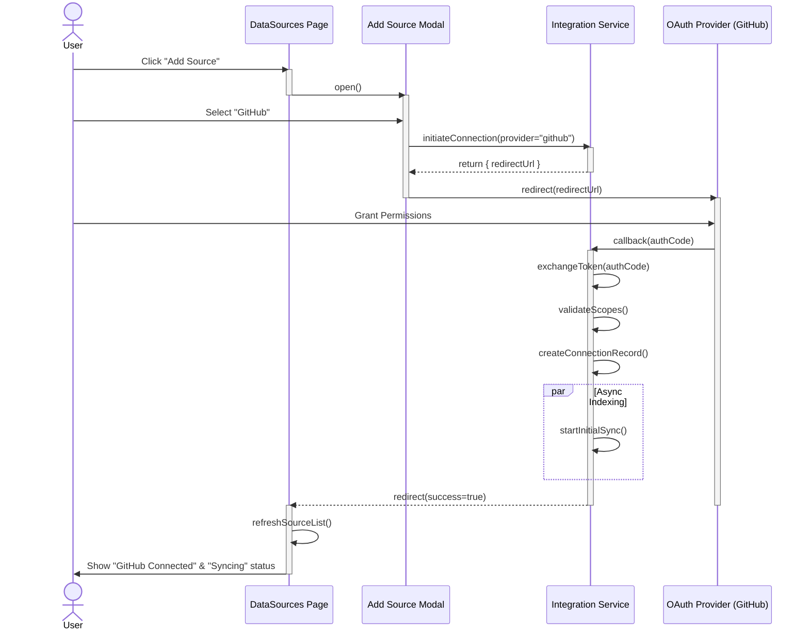

# Infinium Sequence Diagrams

This document details the object interactions for the core workflows of the Infinium platform.

## 1. Query & Reasoning Flow

This sequence models the interaction when a user asks a question about their codebase using the **Query Interface** or **Reasoning Interface**.

### Sequence Diagram (Mermaid)

### Workflow Description
1.  **Initiation**: The user types a natural language query into the input field of the `QueryInterface` or `ReasoningInterface`.
2.  **Processing State**: The UI eagerly updates to show the user's message and enters a "Processing" state (visualized by a loading spinner or skeleton loader).
3.  **Context Retrieval**: The conceptual `AI Engine` queries the internal `Knowledge Base` for indexed documents matches the query terms (e.g., "JWT", "Auth").
4.  **Fallback/Enrichment**: If indexed data is stale or insufficient, the engine may request real-time data from external `Sources` (like checking the latest GitHub commits).
5.  **Synthesis**: The engine synthesizes an answer, citing specific "Information Chunks" (Evidence) and calculating a confidence score for each.
6.  **Presentation**: The UI receives the structured response and renders it. It separates the "Answer" from the "Supporting Evidence" (cards), allowing the user to verify the source of truth.

---

## 2. Connecting a Data Source

This sequence models the flow of a user connecting a new integration (e.g., GitHub) via the **Data Sources** page.

### Sequence Diagram (Mermaid)

### Workflow Description
1.  **Selection**: The user opens the "Add Source" modal from the `DataSources` page and selects a provider (e.g., GitHub).
2.  **Handshake**: The application requests a redirection URL from the backend service to initiate the OAuth flow.
3.  **Authentication**: The user is redirected to the external provider (GitHub) to authorize the application.
4.  **Callback & Verification**: Upon success, the provider calls back the application. The backend validates the token and establishes the persistent connection.
5.  **Indexing**: A background process immediately starts indexing relevant data (repositories, issues) to populate the Knowledge Base.
6.  **Feedback**: The user is returned to the dashboard where the new source connection is verified, and its status is set to `Syncing`.
