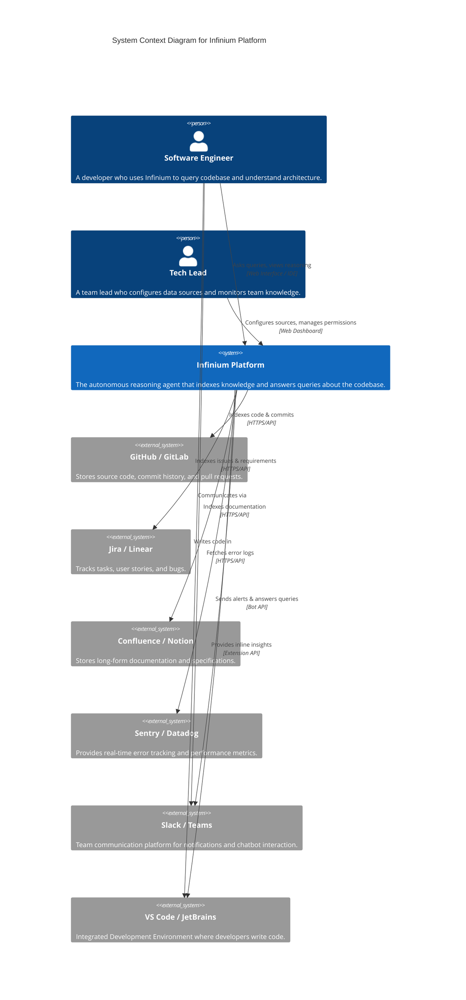

# Infinium System Context Diagram

This document illustrates the high-level context of the **Infinium** platform, showing how it fits into the existing software development ecosystem.

## C4 System Context Diagram (Mermaid)

## System Descriptions

| Element | Type | Description |
| :--- | :--- | :--- |
| **Infinium Platform** | Software System | The core AI-powered application that aggregates data from various sources to provide reasoning and insights about the software project. |
| **Software Engineer** | Person | The primary user who interacts with Infinium to save time on research and debugging. |
| **GitHub / GitLab** | External System | The source of truth for code. Infinium reads repositories, branches, and commit messages to build its context. |
| **Jira / Linear** | External System | Provides the "logical" context (tickets, stories) that links code changes to business requirements. |
| **Sentry / Datadog** | External System | Provides the "operational" context (errors, logs) to help Infinium debug issues. |
| **Slack / Teams** | External System | Acts as both an input source (conversations) and an output channel (bot responses) for Infinium. |
| **VS Code / JetBrains** | External System | The developer's work environment. Infinium integrates here to provide information right where the code is written. |
